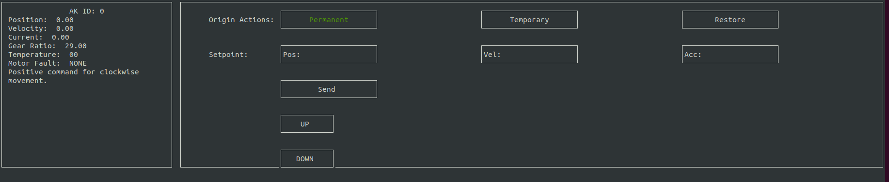

```bash
mkdir build && cd build
cmake ..
sudo make install
```

Once installation is complete, you may test-control any AK motor by using the graphical user interface.

```bash
tmotorui <reduction> <can_interface>
```



If you push UP or DOWN with 'enter' position command is going to be incremented or decremented by 10.
If you push W or S on the keyboard, position command will be incremented or decremented by 1. Created for more precise movement.
Dashboard is also updated with movement direction info according to motor ID. Can only be viewed on fullscreen.

For faster launch, you can write this to terminal:

```bash
tmotor4
```
Which will start all four terminals at once, and you don't need to input gear ratios and can interfaces or motor ID's by hand,
it's all taken care of.